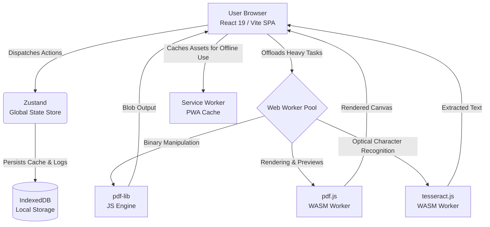

# IHatePDF 📄

> **The ultimate local-first, zero-server, privacy-focused document workspace.**

IHatePDF is a production-grade Web Application designed to compete with popular online PDF tools (like iLovePDF), but with a fundamental architectural difference: **100% of the processing happens on your local device**. 

No servers, no uploads, no privacy risks. Your documents never leave your browser sandbox.

## 🏗️ Architecture & Data Flow

Unlike traditional PDF editors that upload sensitive files to a remote server for processing, IHatePDF utilizes the power of modern WebAssembly (WASM) and multi-threaded Web Workers to perform complex document manipulation directly within the browser.



### 🧠 How It Works
1. **User Browser (React 19 / Vite SPA)**: The incredibly fast and lightweight UI layer built with Tailwind CSS v4 and Shadcn UI.
2. **Zustand Global State**: Provides high-performance, single-directional state management for file queues, configurations, and processing status.
3. **Web Worker Pool**: Heavy operations (like merging 50 large files or running OCR) are offloaded to dedicated background threads, ensuring the main UI never freezes.
4. **pdf-lib & pdf.js**: High-performance libraries that operate directly on binary structures and WebAssembly to merge, split, compress, and render PDFs.
5. **IndexedDB & Service Workers**: Complete offline support (PWA). Language packs and output blobs are cached locally via IndexedDB.

## 🚀 Tech Stack

### Frontend & UI
- **Framework**: React 19 + Vite (Static Export mode / SPA)
- **State Management**: Zustand v5+ (with immer middleware)
- **Styling**: Tailwind CSS v4 + Shadcn UI
- **Routing**: React Router DOM v6
- **Animations**: Framer Motion + Canvas Confetti for micro-interactions

### PDF & Processing Engines
- **PDF Manipulation**: `pdf-lib`
- **PDF Rendering**: `pdfjs-dist`
- **Client-Side OCR**: `tesseract.js`
- **Data Caching**: `idb` (IndexedDB Wrapper)
- **PWA Infrastructure**: `vite-plugin-pwa`

## ✨ Core Features

### 🔒 Privacy & Architecture
- **100% Private**: Zero server uploads. Everything executes client-side.
- **Blazing Fast**: Dynamic lazy-loading of WASM modules.
- **Offline Capable**: Full Progressive Web App (PWA) support allowing you to process PDFs without an internet connection.
- **Rich Visual Aesthetics**: Glassmorphism, modern HSL color palettes, and responsive micro-animations.

### 🧰 Supported Tools
- **Organize & Optimize**: Merge, Split, and Compress PDFs seamlessly.
- **Convert TO PDF**: Word (`.docx`), PowerPoint (`.pptx`), Excel (`.xlsx`), HTML, and Images (JPG/PNG).
- **Convert FROM PDF**: Extract to Word (`.docx`), PowerPoint (`.pptx`), Excel (`.xlsx`), and JPG.
- **Advanced Editing**: Add Page Numbers, Insert Custom Watermarks, Crop Pages, Edit/Annotate PDFs, Fill & Flatten PDF Forms, and Repair Corrupt PDFs.

## 🛠️ Development

To run this project locally:

```bash
# Install dependencies
npm install

# Start the development server
npm run dev

# Build for production
npm run build
```

---
*Built with ❤️ to keep your documents private.*
