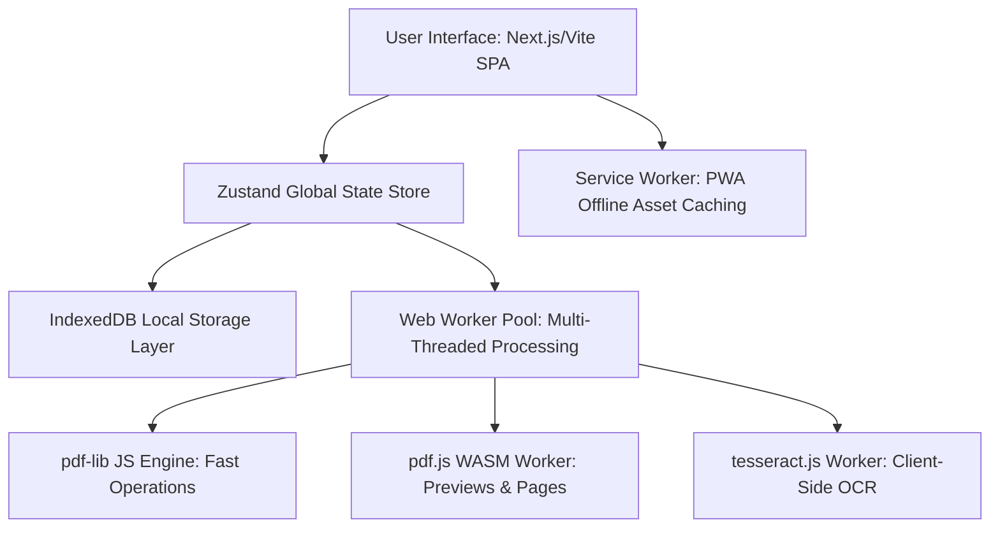

# Technical Stack Spec: IHatePDF (Local-First Document Workspace)

This document defines the highly optimized, 100% client-side, zero-server architecture for **IHatePDF**. It is designed to deliver a premium, production-grade, secure experience that out-competes iLovePDF by using the client's local computing power, enabling full offline capabilities (PWA), and guaranteeing absolute privacy.

---

## 1. Core Architectural Pillars



### A. Local-First Processing
Unlike iLovePDF, which uploads sensitive files to remote servers, **IHatePDF processes all files inside the browser sandbox**. Files are read as `ArrayBuffer` or `Blob` structures in RAM and processed using WebAssembly (WASM) and high-performance JavaScript engines.

### B. Multi-Threaded Sandbox (Web Workers)
To prevent the main thread from freezing during heavy operations (like merging 50 large files or running OCR on a scanned 100-page tax form), all heavy processing is offloaded to a pool of dedicated Web Workers.

### C. Dynamic Lazy Loading
To keep the initial load time under **1.2 seconds** (overcoming standard WASM payload friction), the core application loads with a lightweight interface, dynamically downloading heavy WebAssembly modules and Tesseract language files on-demand only when a user triggers those operations.

---

## 2. Detailed Tech Stack Specifications

### A. Core Frontend Layer
*   **Framework:** `React 19` + `Vite` (Single Page Application, Static Export mode `SPA`). Vite is chosen over Next.js server-side features because the app requires zero server-side rendering and must be deployable as static files to ultra-fast CDN edges (e.g., Cloudflare Pages, Netlify).
*   **Routing:** `react-router-dom` for client-side routing between tools (e.g., `/merge`, `/split`, `/ocr`, `/dashboard`).
*   **State Management:** `Zustand` (v5+) + `immer` middleware for immutable deep updates. Provides a lightweight, high-performance, single-directional state store that coordinates file lists, processing states, and local statistics.

### B. Style & Design Tokens (Rich Visual Aesthetics)
*   **CSS Engine:** `Tailwind CSS v4` (utilizing the new CSS-first design system config).
*   **Component Foundation:** `Shadcn UI` primitives + `@radix-ui` for maximum accessibility (WCAG AA compliance) and premium customizability.
*   **Color Palette (Modern HSL system):**
    *   *Core Brand Color:* Urgent, rich Crimson Red (`hsl(354, 76%, 49%)`) instead of standard raw `#FF0000`.
    *   *Backgrounds:* Sleek, dark mode glassmorphism (`hsl(220, 15%, 8%)` to `hsl(220, 15%, 12%)`) with high contrast text.
*   **Animations:** `Framer Motion` + `@mojs/core` for high-fidelity micro-interactions, drag-and-drop feedback, file processing status bar increments, and confetti cascades upon task completion.

### C. Heavy PDF & OCR Processing Engines
1.  **PDF Manipulation Engine (`pdf-lib`):**
    *   *Usage:* Merging documents, splitting ranges, rotating pages, deleting specific pages, updating metadata, and basic stamp annotations.
    *   *Rationale:* Written in 100% JavaScript, operates directly on binary structures, extremely fast, runs in standard Web Workers without massive WASM overhead.
2.  **PDF Rendering & Preview Engine (`pdfjs-dist`):**
    *   *Usage:* Generating pixel-perfect previews of PDF pages inside the visual drag-and-drop Page Organizer.
    *   *Rationale:* Mozilla’s gold-standard engine, loaded inside a secondary background worker thread.
3.  **Local OCR Engine (`tesseract.js`):**
    *   *Usage:* Client-side optical character recognition for scanned PDFs.
    *   *Rationale:* Employs a Web Worker that downloads highly-trained language packs directly from our static CDN (e.g., `eng.traineddata`), caches it in IndexedDB, and parses pages locally without server costs.

### D. Client-Side Database & Cache Layer
*   **IndexedDB Wrapper:** `idb` (lightweight promise-based IndexedDB utility).
*   **Data Stored:**
    1.  **Language Pack Cache:** Caches `tesseract.js` trained language files (~15MB per language) so they are downloaded exactly once.
    2.  **Telemetry & Analytics Logs:** Action counts, time-saved ratios, CPU efficiency logs, and donation milestone tracker states.
    3.  **File Cache Buffer:** Stores output PDF files locally for 2 hours (using Blobs) to allow seamless tool chaining (e.g., *Split PDF -> Compress Split Ranges -> Watermark*).

### E. Service Worker & PWA Infrastructure
*   **Service Worker Builder:** `Vite PWA Plugin` (`vite-plugin-pwa`).
*   **Caching Strategy:** `CacheFirst` for static assets (fonts, icons, WASM binaries), `StaleWhileRevalidate` for application pages, and dynamic caching for OCR language packs.
*   **Capabilities:** Full offline execution. If a user loses internet access mid-journey, they can still navigate to any tool and process files locally.

### F. Analytics & Integrations (Privacy & Revenue)
*   **Analytics:** `Umami` (self-hosted, cookie-less, lightweight script) or `Plausible` to track aggregate usage metrics (total page views, total files processed) *without* collecting any PII (Personally Identifiable Information).
*   **Donation Engine:** `Stripe Payment Links` or `BuyMeACoffee` API overlay, embedded inside our dynamic "Transparency Dashboard" modal.

---

## 3. Production Dependency Manifest

To ensure both CLI agents (`codex` and `gemini`) install the exact same versions and avoid dependency conflicts, the following version locks must be observed in `package.json`:

```json
{
  "dependencies": {
    "react": "^19.0.0",
    "react-dom": "^19.0.0",
    "react-router-dom": "^6.28.0",
    "zustand": "^5.0.1",
    "pdf-lib": "^1.17.1",
    "pdfjs-dist": "^4.8.69",
    "tesseract.js": "^5.1.1",
    "idb": "^8.0.1",
    "framer-motion": "^11.11.17",
    "lucide-react": "^0.460.0",
    "clsx": "^2.1.1",
    "tailwind-merge": "^2.5.4",
    "canvas-confetti": "^1.9.3"
  },
  "devDependencies": {
    "vite": "^5.4.11",
    "@types/react": "^19.0.0",
    "@types/react-dom": "^19.0.0",
    "tailwindcss": "^4.0.0-alpha.30",
    "vite-plugin-pwa": "^0.21.0",
    "typescript": "^5.6.3"
  }
}
```

---

## 4. File Structure Architecture

Both CLI agents must adhere strictly to this folder hierarchy to prevent import breakage:

```plaintext
IHatePDF/
├── .agent/                  # AG Kit core Personas and Scripts
├── Docs/                    # Product specs and analyses
├── ProcessStatus/
│   └── task.md              # Living task board for Codex and Gemini
├── public/
│   ├── assets/              # Premium SVGs, logos, animations
│   ├── workers/             # Dedicated background worker scripts
│   └── manifest.json        # PWA configuration
├── src/
│   ├── components/
│   │   ├── ui/              # Radix + custom styled base elements
│   │   ├── workspace/       # Common Drag-and-Drop, Loading States, Confetti
│   │   └── dashboard/       # Donation Dashboard, Telemetry Cards
│   ├── store/
│   │   └── useFileStore.ts  # Central Zustand store (file queues, steps)
│   ├── db/
│   │   └── localDb.ts       # IndexedDB instantiation and schemas
│   ├── services/
│   │   ├── pdfService.ts    # Web Worker wrappers for pdf-lib / pdfjs
│   │   └── ocrService.ts    # Web Worker wrappers for tesseract.js
│   ├── views/
│   │   ├── Home.tsx         # Responsive Masonry Grid of Tools
│   │   ├── ToolWorkspace.tsx# Dynamic UI that renders based on URL / tool
│   │   └── Dashboard.tsx    # Privacy statistics & donation triggers
│   ├── styles/
│   │   └── index.css        # Tailwind v4 custom design tokens & glassmorphism
│   ├── App.tsx              # Core app shell & dynamic routes
│   └── main.tsx             # DOM mounting & PWA registration
├── tech_stack.md            # Technical specifications (This file)
├── Schema.md                # Data structures and schemas
├── Rule.md                  # Development regulations for CLI Agents
└── vite.config.ts           # Build optimization & Service Worker routing
```
